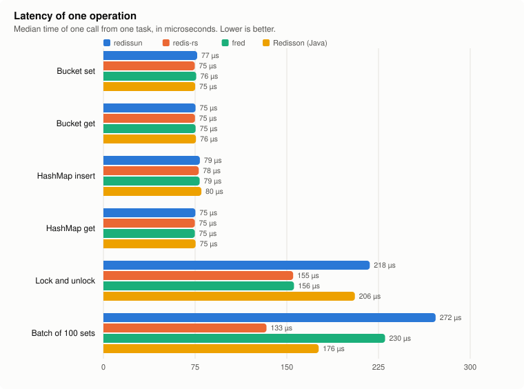

<p align="center">
  
</p>

# redissun

Shared objects on Redis for Rust. It is inspired by [Redisson](https://github.com/redisson/redisson).

[](https://github.com/Empatixx/redissun/actions/workflows/ci.yml)
[](https://crates.io/crates/redissun)
[](https://docs.rs/redissun)
[](LICENSE)

With redissun you use a `HashMap`, a `Bucket` or a `Lock` in your code. The data lives in Redis, so every program that uses the same name sees the same object. It works with tokio, and it is easy to use.

## Install

```bash
cargo add redissun
cargo add tokio --features full
cargo add serde --features derive
```

Or in `Cargo.toml`:

```toml
[dependencies]
redissun = "0.17"
tokio = { version = "1", features = ["full"] }
serde = { version = "1", features = ["derive"] }
```

## Quick start

```rust
use redissun::Client;

#[tokio::main]
async fn main() -> redissun::Result<()> {
    let client = Client::builder().url("redis://127.0.0.1:6379").build().await?;

    let users = client.hash_map::<String, String>("users");
    users.insert("jirka", "Jirka").await?;
    println!("{:?}", users.get("jirka").await?);

    let lock = client.lock("order:42");
    let guard = lock.lock().await?;
    guard.unlock().await?;

    Ok(())
}
```

`Client` is cheap to clone. All clones share the same connections.

## Objects

| Object | Stored in Redis as | Status |
|---|---|---|
| [`Bucket`](https://empatixx.github.io/redissun/docs/objects/bucket) | string | stable |
| [`HashMap`](https://empatixx.github.io/redissun/docs/objects/hash-map) | hash | stable |
| [`Vec`](https://empatixx.github.io/redissun/docs/objects/vec) | list | stable |
| [`VecDeque`](https://empatixx.github.io/redissun/docs/objects/vec-deque) | list | stable |
| [`HashSet`](https://empatixx.github.io/redissun/docs/objects/hash-set) | set | stable |
| [`LocalCachedMap`](https://empatixx.github.io/redissun/docs/objects/local-cached-map) | hash and pub/sub | experimental |
| [`Lock`](https://empatixx.github.io/redissun/docs/objects/lock) | hash and pub/sub | stable |
| [`RwLock`](https://empatixx.github.io/redissun/docs/objects/rw-lock) | hash, set, strings and pub/sub | stable |
| [`FairLock`](https://empatixx.github.io/redissun/docs/objects/fair-lock) | hash, list, sorted set and pub/sub | stable |
| [`FencedLock`](https://empatixx.github.io/redissun/docs/objects/fenced-lock) | hash, string and pub/sub | stable |
| [`MultiLock`](https://empatixx.github.io/redissun/docs/objects/multi-lock) | the locks it holds | stable |
| [`SortedSet`](https://empatixx.github.io/redissun/docs/objects/sorted-set) | sorted set | stable |
| [`DelayedQueue`](https://empatixx.github.io/redissun/docs/objects/delayed-queue) | list, sorted set and pub/sub | experimental |
| [`BitSet`](https://empatixx.github.io/redissun/docs/objects/bit-set) | string | stable |
| [`HyperLogLog`](https://empatixx.github.io/redissun/docs/objects/hyper-log-log) | HyperLogLog | stable |
| [`BloomFilter`](https://empatixx.github.io/redissun/docs/objects/bloom-filter) | string and hash | experimental |
| [`HashMapCache`](https://empatixx.github.io/redissun/docs/objects/hash-map-cache) | hash and sorted set | experimental |
| [`HashSetCache`](https://empatixx.github.io/redissun/docs/objects/hash-set-cache) | sorted set | experimental |
| [`Topic`](https://empatixx.github.io/redissun/docs/objects/topic) | pub/sub | stable |
| [`Stream`](https://empatixx.github.io/redissun/docs/objects/stream) | stream | experimental |
| [`Geo`](https://empatixx.github.io/redissun/docs/objects/geo) | sorted set | stable |
| [`AtomicI64`](https://empatixx.github.io/redissun/docs/objects/atomic-i64) | string | stable |
| [`Semaphore`](https://empatixx.github.io/redissun/docs/objects/semaphore) | string and pub/sub | stable |
| [`CountDownLatch`](https://empatixx.github.io/redissun/docs/objects/count-down-latch) | string and pub/sub | experimental |
| [`RateLimiter`](https://empatixx.github.io/redissun/docs/objects/rate-limiter) | hash, string and sorted set | stable |
| [`Batch`](https://empatixx.github.io/redissun/docs/objects/batch) | the commands it holds | experimental |
| [`Script, Function`](https://empatixx.github.io/redissun/docs/guides/scripts) | Lua scripts and functions | experimental |

Every object follows Redisson's logic and is tested with Redisson's own tests, ported to Rust. **Stable** objects are also thin wrappers over Redis commands or pass the fault-injection tests and the Sentinel and Cluster failover tests. **Experimental** objects are not yet tested under faults, and their API may still change. Every object also has the common methods `name`, `del`, `exists`, `rename`, `expire`, `ttl` and `persist` (add `use redissun::Object;`).

## Benchmarks

redissun runs the same operations as hand-written code on [redis-rs](https://crates.io/crates/redis) and [fred](https://crates.io/crates/fred), and as [Redisson](https://github.com/redisson/redisson) in Java. Redis runs on the same machine, so the charts show what the client costs, not the network.

<p align="center">
  
</p>
<p align="center">
  
</p>

- **One call:** a get, a set and a map insert take about 75 µs on every library. That is the Redis round trip on this machine, and the client adds under 3 µs.
- **64 tasks:** redissun is 7 to 15 % below the hand-written redis-rs and about as fast as fred. Redisson's blocking API with 64 threads reaches about a third.
- **Lock:** a redissun lock is slower than a bare `SET NX` plus a Lua unlock (218 against 155 µs), because it is reentrant, wakes waiters through pub/sub and renews its lease. Under load it handles twice as many locks as Redisson, at about the same latency (218 against 206 µs).
- **Batch:** redissun's `Batch` is the slowest of the four for 100 commands (272 µs, redis-rs needs 133 µs). I have not profiled why.

Median of three runs on an Apple M5 Pro with Redis 8.10 on the same machine, which was not idle. How it was measured, what the hand-written code does, and how to run it yourself: [Benchmarks](https://empatixx.github.io/redissun/docs/guides/benchmarks).

## Documentation

Everything else lives in the guides, so this page stays short.

- [Getting started](https://empatixx.github.io/redissun/docs/getting-started/quick-start) and [one page per object](https://empatixx.github.io/redissun/docs)
- [Configuration](https://empatixx.github.io/redissun/docs/guides/configuration): every setting and its default, Redisson's names, TLS, Sentinel and Cluster
- [Codecs](https://empatixx.github.io/redissun/docs/guides/codecs), [Scripts and Functions](https://empatixx.github.io/redissun/docs/guides/scripts)
- [Limitations](https://empatixx.github.io/redissun/docs/guides/limitations): read this before you rely on a lock for correctness
- [Coming from Redisson?](https://empatixx.github.io/redissun/docs/guides/redisson-migration)
- [API reference](https://docs.rs/redissun) and the [`examples/`](examples) folder

## Requirements

- Redis or Valkey 6.2 or newer. `Function` needs 7.0.
- Rust 2021 edition.

## Development

```bash
cargo fmt --all -- --check
cargo clippy --all-targets --all-features -- -D warnings
cargo test --all-features
```

The tests start Redis with Docker (testcontainers). With Colima, set `DOCKER_HOST` to its socket. To use a Redis you already run, which is faster, set `REDISSUN_TEST_REDIS_URL=redis://localhost:6379`.

Slower tests are marked `#[ignore]` and start their own Redis, Sentinel and Cluster: `cargo test --test chaos --test sentinel --test cluster -- --ignored`. The TLS tests need a TLS feature: `cargo test --features tls-rustls --test tls -- --include-ignored`. To reproduce the benchmarks, see [`benches/README.md`](benches/README.md).

## License

Apache-2.0. See [LICENSE](LICENSE).
